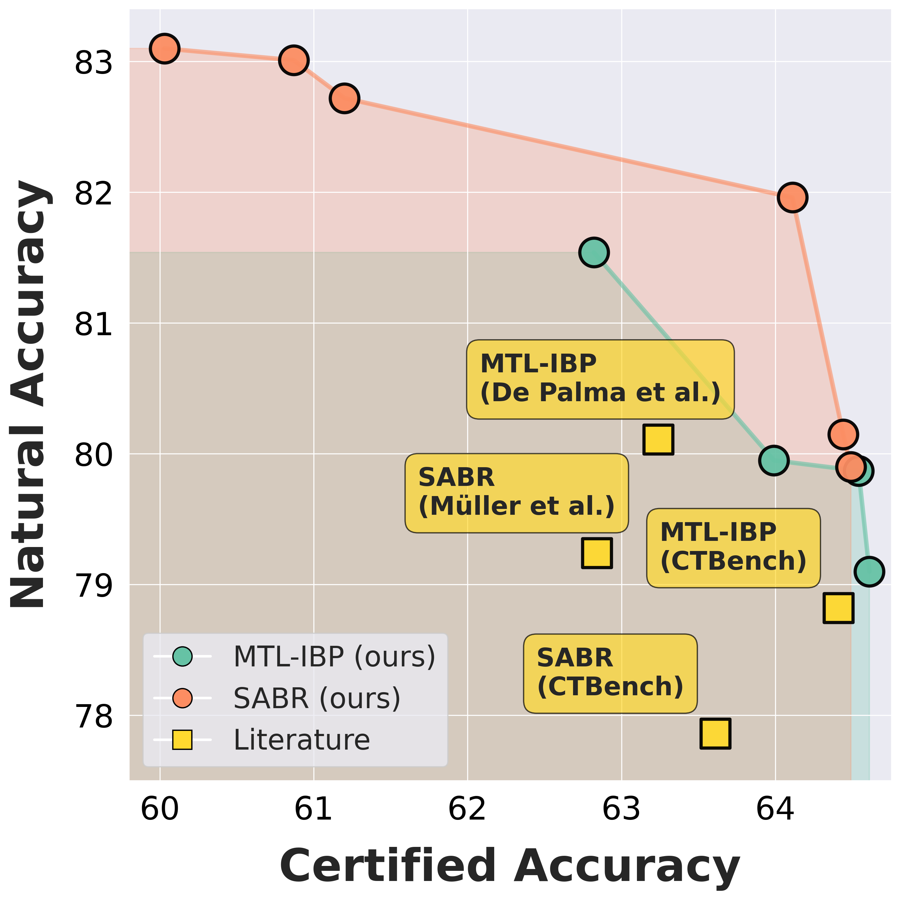

<p align="center">
  
</p>

<h1 align="center">CTRAIN</h1>

<p align="center">
  <strong>A training and evaluation library for certifiably robust neural networks.</strong>
</p>

<p align="center">
  <a href="LICENSE">MIT License</a> ·
  <a href="docs/">Documentation</a> ·
  <a href="papers/rethinking_evaluation_paradigms/">Paper Artifacts</a>
</p>

<!-- Logo wildcard: replace docs/assets/CTRAIN_LOGO.png with your preferred logo asset. -->

CTRAIN is a unified, modular, and comprehensive PyTorch framework for training
certifiably robust neural networks and evaluating their robustness. It brings
several leading certified training techniques behind a common wrapper
interface, provides standard data loaders and model definitions, and connects
training to adversarial, incomplete, and complete verification pipelines.

In addition to being a practical certified-training toolbox, CTRAIN now
includes the multi-objective HPO procedure developed for the paper
**"Rethinking Evaluation Paradigms in IBP-based Certified Training"**. This
procedure helps researchers tune certified training methods across the full
natural-certified accuracy trade-off and compare methods by Pareto fronts
instead of single hand-picked configurations.

The project is developed at the Chair for Artificial Intelligence Methodology
at RWTH Aachen University.

## 🚀 Why CTRAIN?

Certified training research combines demanding optimization, bound
computation, model design, and verification. CTRAIN packages these pieces into
a reusable workflow: choose a training method, wrap a PyTorch model, train with
certified objectives, and evaluate the resulting network with adversarial,
incomplete, or complete verification.

The library is built for day-to-day experimentation as well as reproducible
research. You can run a single certified training experiment in a few lines of
code, use the same wrapper API across methods, and then scale up to
multi-objective HPO when you need a principled view of the natural-certified
accuracy trade-off.

## ✨ Highlights

- Unified certified training wrappers for IBP-style methods built on
  [`auto_LiRPA`](https://proceedings.neurips.cc/paper/2020/file/0cbc5671ae26f67871cb914d81ef8fc1-Paper.pdf).
- Implementations of popular certified training methods, including IBP,
  CROWN-IBP, SABR, TAPS, STAPS, and MTL-IBP.
- PyTorch-native model definitions, dataset loaders, and training utilities
  for easy integration into existing research code.
- Adversarial evaluation with PGD, incomplete verification with IBP/CROWN
  variants, and complete verification through alpha-beta-CROWN.
- Method-specific configuration spaces and a common wrapper API for training,
  evaluation, checkpointing, and HPO.
- Multi-objective HPO for natural and certified accuracy using Optuna/BoTorch,
  as developed for our publication on Pareto-based evaluation of IBP-based certified training.
- MIT-licensed project code.

## 📚 Supported Methods

Certified training:

- Interval Bound Propagation (IBP) from
  [Gowal et al., 2018](https://arxiv.org/abs/1810.12715), with improvements
  from [Shi et al., 2021](https://arxiv.org/abs/2102.06700)
- CROWN-IBP ([Zhang et al., 2020](https://arxiv.org/abs/1906.06316))
- SABR ([Müller et al., 2023](https://arxiv.org/pdf/2210.04871))
- TAPS ([Mao et al., 2023](https://proceedings.neurips.cc/paper_files/paper/2023/file/e8b0c97b34fdaf58b2f48f8cca85e76a-Paper-Conference.pdf))
- STAPS, combining SABR and TAPS
  ([Mao et al., 2023](https://proceedings.neurips.cc/paper_files/paper/2023/file/e8b0c97b34fdaf58b2f48f8cca85e76a-Paper-Conference.pdf))
- MTL-IBP ([De Palma et al., 2023](https://arxiv.org/pdf/2305.13991))

Evaluation:

- PGD adversarial evaluation ([Madry et al., 2018](https://arxiv.org/abs/1706.06083))
- IBP ([Gowal et al., 2018](https://arxiv.org/abs/1810.12715)),
  CROWN-IBP ([Zhang et al., 2020](https://arxiv.org/abs/1906.06316)), and
  CROWN ([Zhang et al., 2018](https://arxiv.org/abs/1811.00866)) incomplete
  verification
- alpha-beta-CROWN complete verification
  ([Xu et al., 2020](https://arxiv.org/pdf/2011.13824),
  [Wang et al., 2021](https://arxiv.org/abs/2103.06624))

## ⚙️ Installation

Install the package from PyPI:

```bash
pip install CTRAIN
```

For development from this repository:

```bash
git submodule init
git submodule update
pip install --no-deps git+https://github.com/KaidiXu/onnx2pytorch@8447c42c3192dad383e5598edc74dddac5706ee2
pip install --no-deps git+https://github.com/Verified-Intelligence/auto_LiRPA.git@cf0169ce6bfb4fddd82cfff5c259c162a23ad03c
pip install -e ".[dev]"
```

## 🧪 Quick Start

Train and evaluate a CNN7 model on CIFAR-10 with the Shi-style IBP wrapper:

```python
from CTRAIN.model_definitions import CNN7_Shi
from CTRAIN.data_loaders import load_cifar10
from CTRAIN.model_wrappers import ShiIBPModelWrapper

train_loader, test_loader = load_cifar10(val_split=False)
input_shape = [3, 32, 32]

model = CNN7_Shi(in_shape=input_shape)
wrapped_model = ShiIBPModelWrapper(
    model=model,
    input_shape=input_shape,
    eps=2 / 255,
    num_epochs=160,
)

wrapped_model.train_model(train_loader)
std_acc, cert_acc, adv_acc = wrapped_model.evaluate(test_loader)
```

## 🎯 Pareto-based Evaluation of IBP-based Certified Training

<p align="center">
  
</p>

Use the same wrapper interface for multi-objective HPO. The `hpo` method runs
the Pareto-front optimisation procedure, stores the Optuna study and
checkpoints, and returns all Pareto-optimal trial records:

```python
from CTRAIN.model_definitions import CNN7_Shi
from CTRAIN.data_loaders import load_cifar10
from CTRAIN.model_wrappers import MTLIBPModelWrapper
import torch

train_loader, val_loader, test_loader = load_cifar10(
    batch_size=512,
    val_split=True,
)
input_shape = [3, 32, 32]

model = CNN7_Shi(in_shape=input_shape)
wrapped_model = MTLIBPModelWrapper(
    model=model,
    input_shape=input_shape,
    eps=2 / 255,
    num_epochs=160,
)

pareto_front = wrapped_model.hpo(
    train_loader=train_loader,
    val_loader=val_loader,
    budget_trials=100,
    eval_samples=10_000,
    output_dir="hpo_runs/cifar10_cnn7_mtl_ibp_2_255_seed0",
    min_cert_acc=0.40,
    min_nat_acc=0.60,
    seed=0,
    sampler="botorch",
)

chosen = max(pareto_front, key=lambda trial: trial["metrics"]["cert_acc"])
wrapped_model.load_state_dict(torch.load(chosen["checkpoint_path"]))
std_acc, cert_acc, adv_acc = wrapped_model.evaluate(test_loader)
```

The paper-specific reproduction guide is in
`papers/rethinking_evaluation_paradigms/README.md`.

## 🗂️ Project Structure

```text
CTRAIN/
|-- CTRAIN/
|   |-- attacks/                 # PGD and related adversarial tools
|   |-- bound/                   # Bound computation backends
|   |-- complete_verification/   # alpha-beta-CROWN integration
|   |-- data_loaders/            # Dataset loading utilities
|   |-- eval/                    # Robustness evaluation
|   |-- model_definitions/       # CNN and ResNet architectures
|   |-- model_wrappers/          # Method-specific training wrappers and HPO
|   |-- train/                   # Certified/adversarial training internals
|   `-- util/                    # Shared utilities
|-- docs/                        # API docs and examples
`-- papers/
    `-- rethinking_evaluation_paradigms/
        |-- mo_hpo/              # Maintained paper reproduction entrypoints
        |-- submitit_experiments/ # Original SLURM/submitit experiment scripts
        |-- eval/                # Plotting, tables, and analyses
        `-- results/             # Paper result artifacts
```

## 📖 Documentation

The `docs/` directory contains API documentation and examples, including
certified training, model evaluation, and hyperparameter optimisation notebooks.

## 📝 Paper and Citation
If you use CTRAIN in your experiments, we kindly ask you to cite the following papers in which CTRAIN was developed:

Tool paper:
```bibtex
@inproceedings{KauHoo25,
	title        = {{CTRAIN} - A Training Library for Certifiably Robust Neural Networks},
	author       = {Kaulen, Konstantin and Hoos, Holger},
	year         = 2025,
	booktitle    = {Proceedings of the 8th International Symposium on AI Verification (SAIV 2025)},
	pages        = {1--12}
}
```

For the multi-objective HPO workflow or the artifacts in
`papers/rethinking_evaluation_paradigms`, please cite:

```bibtex
@inproceedings{KauEtAl26,
  title = {Rethinking Evaluation Paradigms in IBP-based Certified Training},
  author = {Kaulen, Konstantin and Shavit, Hadar and Hoos, Holger H},
  booktitle={To appear in: Proceedings of the 43rd International Conference on Machine Learning (ICML 2026)},
  year="2026"
}
```

## 📄 License

This project is licensed under the [MIT License](LICENSE).

CTRAIN incorporates alpha-beta-CROWN components and depends heavily on
`auto_LiRPA`; those upstream components are developed by the Verified
Intelligence team and are distributed under their respective licenses.

## 👥 Maintainers

CTRAIN was developed by Konstantin Kaulen at the Chair for Artificial
Intelligence Methodology at RWTH Aachen University under the supervision of
Prof. Holger H. Hoos. Konstantin Kaulen is the current core maintainer.

Contributions, issues, and pull requests are welcome.
