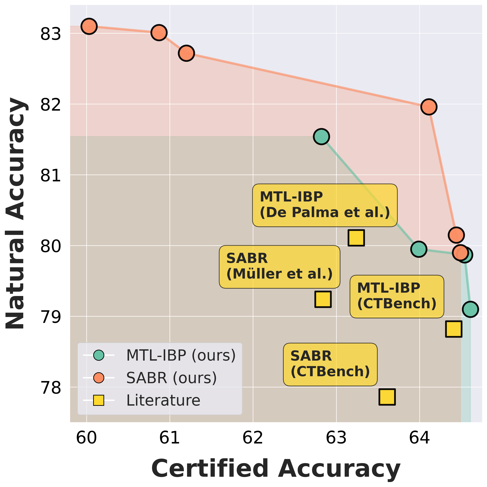

<p align="center">
  
</p>

<h1 align="center">Rethinking Evaluation Paradigms in IBP-based Certified Training</h1>

Code and results for the paper **“Rethinking Evaluation Paradigms in
IBP-based Certified Training.”**

## 🎯 Summary

Certified-training methods are often compared using one hand-picked
configuration per method. This can be misleading: natural accuracy and
certified accuracy form a trade-off, and each method exposes several
hyperparameters that move a model along that trade-off.

We instead evaluate methods through their **Pareto fronts**. For each method,
we use multi-objective hyperparameter optimisation to search for configurations
that balance natural and certified accuracy, then compare the resulting fronts
rather than isolated points.

The study covers IBP, CROWN-IBP, SABR, and MTL-IBP across CIFAR-10, Tiny
ImageNet, MNIST, and several network architectures. Its main observations are:

- automated tuning frequently improves over previously reported
  configurations;
- no single method is strongest across the entire accuracy trade-off;
- older methods still contribute competitive points to the combined front;
- method rankings depend on which part of the trade-off is relevant.

## ⚙️ Setup

From the repository root:

```bash
python -m venv .venv
source .venv/bin/activate
pip install -e ".[dev]"
ctrain-install-git-deps
```

The frozen paper environment is recorded in `requirements-paper.txt`.

## 🤗 Published Pareto-front checkpoints

The original checkpoints on the final, completely verified Pareto fronts are
published in the
[`kkaulen/ctrain_pareto_fronts`](https://huggingface.co/kkaulen/ctrain_pareto_fronts)
Hugging Face model repository. The checked-in `model_manifest.json` identifies
all 145 models on the final per-method fronts and records their reported
accuracies and SHA-256 digests. CIFAR-10 CNN7 and Tiny ImageNet use the main
10,000-sample/1,000-second results; MNIST and the additional architecture-study
networks use the paper's 1,000-sample/300-second results. Alternate-budget
comparison fronts are not mixed into the published model set.

List a subset without downloading its weights:

```bash
python papers/rethinking_evaluation_paradigms/model_hub.py list \
  --dataset cifar10 --architecture cnn7 --method sabr --epsilon 0.00784313725490196
```

Add the same filters to `download --all` to materialize a complete front in a
local directory while retaining the repository layout:

```bash
python papers/rethinking_evaluation_paradigms/model_hub.py download --all \
  --dataset cifar10 --architecture cnn7 --method sabr \
  --epsilon 0.00784313725490196 --local-dir paper-models
```

From Python, select and load a model directly into its CTRAIN wrapper:

```python
from papers.rethinking_evaluation_paradigms.model_hub import (
    list_models,
    load_model,
)

models = list_models(
    dataset="cifar10",
    architecture="cnn7",
    method="sabr",
    epsilon=2 / 255,
)
model = load_model(config_hash=models[0]["config_hash"], device="cuda")
logits = model(images)
```

The runnable
[MTL-IBP Pareto-front example](examples/evaluate_mtl_front.py) prints the
front, selects its highest-certified member, downloads it, and evaluates it on
CIFAR-10 with CTRAIN:

```bash
python papers/rethinking_evaluation_paradigms/examples/evaluate_mtl_front.py
```

The default evaluates all 10,000 test examples using IBP certification and a
PGD attack. CUDA is strongly recommended because CTRAIN's default attack uses
30 restarts of 100 steps. Use `--test-samples 100` for a shorter run, `--index`
or `--config-hash` to select another front member, and `--list-only` to inspect
the manifest without downloading anything.

`load_model` reconstructs the architecture and certified-training wrapper,
downloads only the selected checkpoint through the Hugging Face cache, checks
its SHA-256 digest, loads it with PyTorch's weights-only loader, and returns it
in evaluation mode. Pass `return_metadata=True` to receive `(model, metadata)`.
Set `CTRAIN_PAPER_HF_REPO` or pass `repo_id=` if the repository ID is not
embedded in the manifest.

The publication utility deterministically derives the model set from the two
paper summaries, requires every source checkpoint to exist, and creates a
resumable upload directory. It refuses unexpected or conflicting files:

```bash
python papers/rethinking_evaluation_paradigms/publish_models.py \
  --checkpoint-root /path/to/cifar10/hpo/results \
  --checkpoint-root /path/to/mnist-and-tinyimagenet/hpo/results \
  --repo-id YOUR_NAMESPACE/YOUR_REPOSITORY \
  --staging-dir papers/rethinking_evaluation_paradigms/.hf-upload \
  --upload
```

Uploading requires a Hugging Face token with write access. Without `--upload`,
the command only rebuilds and audits the manifest; supplying `--staging-dir`
also prepares the local repository tree.

## 🔬 Experimental workflow

Each benchmark uses 100 HPO trials for each of three independent seeds. The
maintained pipeline then has three steps:

1. Run three multi-objective HPO seeds with `mo_hpo/run_hpo.py`.
2. Combine their feasible Pareto points with `mo_hpo/calculate_fronts.py`.
3. Completely verify the subselected checkpoints with
   `mo_hpo/verify_front.py` or the chunked SLURM launcher.

HPO uses inexpensive incomplete verification to explore the search space.
After combining the seed-wise studies, dominated and infeasible trials are
removed and nearby Pareto points are clustered. The selected checkpoints are
then evaluated with complete verification for the reported results.

The resulting CSV records every Pareto point, its source study and checkpoint
hash, and whether it belongs to the verification subset.

### Example: one HPO seed

```bash
python papers/rethinking_evaluation_paradigms/mo_hpo/run_hpo.py \
  --dataset cifar10 \
  --network cnn7 \
  --method mtl_ibp \
  --eps 0.00784313725490196 \
  --seed 0 \
  --epochs 160 \
  --budget-trials 100 \
  --min-cert-acc 0.40 \
  --min-nat-acc 0.60 \
  --output-root papers/rethinking_evaluation_paradigms/results/hpo/main/optuna_studies
```

HPO uses incomplete verification on the configured evaluation loader. Pass
`--val-split` to use a held-out validation split.

### Experiment grid

| Dataset | Networks | Radius | Epochs | Complete-verification setup |
| --- | --- | ---: | ---: | --- |
| CIFAR-10 | CNN7 | `2/255` | 160 | 10,000 samples, 1,000s |
| CIFAR-10 | CNN7 | `8/255` | 260 | 10,000 samples, 1,000s |
| Tiny ImageNet | CNN7 | `1/255` | 160 | 10,000 samples, 1,000s |
| MNIST | CNN7 | `0.3` | 70 | 1,000 samples, 300s |
| CIFAR-10 architecture study | CNN5, CNN7, CNN7 Wide, CNN7 Narrow, CNN9 | `2/255` | 160 | 1,000 samples, 300s |

Each setting is run with MTL-IBP, SABR, IBP, and CROWN-IBP. Loss fusion is
disabled for the CIFAR-10 and MNIST CROWN-IBP runs and enabled for Tiny
ImageNet.

### Combine the three seeds

```bash
python papers/rethinking_evaluation_paradigms/mo_hpo/calculate_fronts.py \
  --study papers/rethinking_evaluation_paradigms/results/hpo/main/optuna_studies/cifar10_cnn7_mtl_ibp_0.00784313725490196_0/optuna_study.db \
  --study papers/rethinking_evaluation_paradigms/results/hpo/main/optuna_studies/cifar10_cnn7_mtl_ibp_0.00784313725490196_1/optuna_study.db \
  --study papers/rethinking_evaluation_paradigms/results/hpo/main/optuna_studies/cifar10_cnn7_mtl_ibp_0.00784313725490196_2/optuna_study.db \
  --method mtl_ibp \
  --eps 0.00784313725490196 \
  --output papers/rethinking_evaluation_paradigms/results/hpo/main/pareto_fronts/pareto_front_mtl_ibp_cnn7_cifar10_0.00784313725490196.csv
```

The calculator retains feasible, completed trials from the first 100 trials
per seed, constructs the joint Pareto front, and marks the clustered
verification subset.

### Completely verify a front

```bash
python papers/rethinking_evaluation_paradigms/mo_hpo/verify_front.py \
  --front papers/rethinking_evaluation_paradigms/results/hpo/main/pareto_fronts/pareto_front_mtl_ibp_cnn7_cifar10_0.00784313725490196.csv \
  --study-root papers/rethinking_evaluation_paradigms/results/hpo/main/optuna_studies \
  --dataset cifar10 \
  --network cnn7 \
  --method mtl_ibp \
  --eps 0.00784313725490196 \
  --timeout 1000 \
  --test-samples 10000 \
  --results-root papers/rethinking_evaluation_paradigms/results/verification/main
```

`verify_front.py` verifies the rows marked `subselected` by default. Use
`--selection all` to process the entire Pareto front. Both SLURM launchers are
strictly limited to final, subselected fronts and default to the main-paper
fronts under `results/hpo/main/pareto_fronts`:

```bash
# One job per selected checkpoint.
python papers/rethinking_evaluation_paradigms/submitit_experiments/submit_complete_verification.py

# Multiple dataset-index chunks per selected checkpoint.
python papers/rethinking_evaluation_paradigms/submitit_experiments/submit_chunked_complete_verification.py
```

Inspect the displayed jobs, then add `--submit`. Both launchers share the same
checkpoint-discovery function, so their selected network set is identical.
Select another front directory explicitly; for example, validation-split runs
use:

```bash
python papers/rethinking_evaluation_paradigms/submitit_experiments/submit_complete_verification.py \
  --hpo-root /path/to/validation_hpo_results \
  --fronts-root papers/rethinking_evaluation_paradigms/results/hpo/validation/pareto_fronts \
  --results-root papers/rethinking_evaluation_paradigms/results/verification/validation

python papers/rethinking_evaluation_paradigms/submitit_experiments/submit_chunked_complete_verification.py \
  --hpo-root /path/to/validation_hpo_results \
  --fronts-root papers/rethinking_evaluation_paradigms/results/hpo/validation/pareto_fronts \
  --results-root papers/rethinking_evaluation_paradigms/results/verification/validation
```

### Audit and merge chunked verification results

The audit reports unfinished instances and atomically consolidates all finished
instances into the authoritative `results.json` beside the chunks:

```bash
CTRAIN_PAPER_HPO_ROOT=/path/to/hpo/results \
python papers/rethinking_evaluation_paradigms/submitit_experiments/submit_chunked_complete_verification.py \
  --audit-results
```

The operation is safe to rerun: unchanged files are left untouched. Job
discovery uses this accumulated coverage, so a cancelled run can be resumed
with smaller chunks after all old workers have stopped:

```bash
python papers/rethinking_evaluation_paradigms/submitit_experiments/submit_chunked_complete_verification.py \
  --hpo-root /path/to/hpo/results \
  --fronts-root papers/rethinking_evaluation_paradigms/results/hpo/validation/pareto_fronts \
  --results-root papers/rethinking_evaluation_paradigms/results/verification/validation \
  --instances-per-chunk 500 \
  --audit-results

# Inspect the dry run, then repeat with --submit.
```

Do not launch the replacement jobs while the cancelled workers are still
running: discovery assumes that no other chunk campaign is modifying the same
configurations.

Create the analysis summary from the merged files with:

```bash
python papers/rethinking_evaluation_paradigms/eval/combine_results.py \
  --verification-root papers/rethinking_evaluation_paradigms/results/verification/main \
  --clean-root papers/rethinking_evaluation_paradigms/results/verification/clean_accuracy
```

### MTL-IBP alpha sweep

The fixed-alpha experiment isolates how MTL-IBP's alpha parameter moves models
along the natural–certified accuracy trade-off:

```bash
python papers/rethinking_evaluation_paradigms/mo_hpo/run_mtl_ibp_alpha_sweep.py 2/255
python papers/rethinking_evaluation_paradigms/mo_hpo/run_mtl_ibp_alpha_sweep.py 8/255
```

The corresponding SLURM array launcher is
`mo_hpo/submit_mtl_ibp_alpha_sweep.slurm`.

Compare the sweep's incomplete-verification front against the subselected
MTL-IBP runs that remain Pareto-optimal after complete verification:

```bash
python papers/rethinking_evaluation_paradigms/eval/plot_mtl_alpha_sweep_results.py \
  --plot-formats pdf,png
```

Plots are written under `plots/alpha_sweep/`. Pass
`--fronts-root` or `--complete-summary` to use other result artifacts.

### Outputs and logs

```text
results/hpo/main/optuna_studies/             main-paper Optuna studies
results/hpo/main/pareto_fronts/              main-paper Pareto fronts
results/hpo/validation/                      validation-tuned studies and fronts
results/hpo/alpha_sweep/                     fixed-alpha runs and summaries
results/verification/main/                   published verification results
results/verification/validation/             validation-tuned chunked results
results/verification/clean_accuracy/         clean-accuracy evaluations
results/analysis/                             processed comparison data
plots/                                       all generated figures
tables/                                      all generated tables
logs/submitit/                               SLURM stdout, stderr, and metadata
```

For validation-split analysis, the repository additionally includes the 24
complete CIFAR-10 studies under `results/hpo/validation/optuna_studies/` and their fronts under
`results/hpo/validation/pareto_fronts/`.

The roots can be changed with the script arguments or the
`CTRAIN_DATA_ROOT`, `CTRAIN_PAPER_HPO_ROOT`, and `CTRAIN_PAPER_RESULTS_ROOT`
environment variables.

## 📊 Reproduce plots and tables

The repository includes the processed verification summaries used by the
analysis scripts. Regenerate the main figures, tables, front statistics,
correlation analysis, and runtime summary with:

```bash
python papers/rethinking_evaluation_paradigms/eval/plot_motivation.py
python papers/rethinking_evaluation_paradigms/eval/plot.py
python papers/rethinking_evaluation_paradigms/eval/tables.py
python papers/rethinking_evaluation_paradigms/eval/front_analysis.py
python papers/rethinking_evaluation_paradigms/eval/verify_correlation.py
python papers/rethinking_evaluation_paradigms/eval/verification_times.py
```

### Architecture comparison

```bash
python papers/rethinking_evaluation_paradigms/eval/plot.py \
  --summary papers/rethinking_evaluation_paradigms/results/verification/main/summary_results_timeout300_testsamples1000.json \
  --output-dir papers/rethinking_evaluation_paradigms/plots/appendix/timeout300_testsamples1000 \
  --architecture-comparisons

python papers/rethinking_evaluation_paradigms/eval/tables.py \
  --summary papers/rethinking_evaluation_paradigms/results/verification/main/summary_results_timeout300_testsamples1000.json \
  --output-dir papers/rethinking_evaluation_paradigms/tables/appendix_timeout300_testsamples1000
```

### Timeout comparison

```bash
python papers/rethinking_evaluation_paradigms/eval/plot.py \
  --timeout-comparisons --comparisons-only
```

### Validation-split result plots (optional)

The commands above remain the main-paper defaults. To plot the separately
verified validation-tuned fronts, first audit the chunked run. Each audit also
merges every completed configuration into `results.json`:

```bash
CTRAIN_PAPER_HPO_ROOT=/path/to/validation_hpo_results \
python papers/rethinking_evaluation_paradigms/submitit_experiments/submit_chunked_complete_verification.py \
  --fronts-root papers/rethinking_evaluation_paradigms/results/hpo/validation/pareto_fronts \
  --results-root papers/rethinking_evaluation_paradigms/results/verification/validation \
  --audit-results
```

After the audit reports zero pending instances, evaluate clean test accuracy
for the same checkpoints and build the validation summary:

```bash
CTRAIN_PAPER_HPO_ROOT=/path/to/validation_hpo_results \
python papers/rethinking_evaluation_paradigms/eval/eval_nat_acc.py

python papers/rethinking_evaluation_paradigms/eval/combine_results.py \
  --verification-root papers/rethinking_evaluation_paradigms/results/verification/validation \
  --clean-root papers/rethinking_evaluation_paradigms/results/verification/clean_accuracy \
  --test-samples 10000 \
  --artificial-timeout 1000 \
  --output papers/rethinking_evaluation_paradigms/results/verification/validation/summary_results_val_set.json
```

Generate the validation-tuned Pareto plots with:

```bash
python papers/rethinking_evaluation_paradigms/eval/plot.py \
  --summary papers/rethinking_evaluation_paradigms/results/verification/validation/summary_results_val_set.json \
  --output-dir papers/rethinking_evaluation_paradigms/plots/validation_fronts
```

For the incomplete-verification Tiny ImageNet validation studies, compare them
directly with the archived main-paper studies using:

```bash
python papers/rethinking_evaluation_paradigms/eval/validation_vs_test_tuning.py \
  --dataset tinyimagenet \
  --validation-root /storage/work/robust_nas/tinyimagenet_val \
  --test-root papers/rethinking_evaluation_paradigms/results/hpo/main/optuna_studies \
  --plot-formats pdf,png
```

Its data and figures are written under
`results/analysis/validation_vs_test/incomplete/tinyimagenet/` and
`plots/validation_vs_test/incomplete/`, respectively.

To plot validation-tuned versus main-paper complete-verification fronts:

```bash
python papers/rethinking_evaluation_paradigms/eval/validation_vs_test_tuning.py \
  --skip-incomplete \
  --validation-complete-summary papers/rethinking_evaluation_paradigms/results/verification/validation/summary_results_val_set.json \
  --test-complete-summary papers/rethinking_evaluation_paradigms/results/verification/main/summary_results.json \
  --output-dir papers/rethinking_evaluation_paradigms/results/analysis/validation_vs_test/complete/cifar10 \
  --plot-formats pdf,png
```

The included `results/hpo/validation/optuna_studies/` databases reproduce the HPO objectives and
fronts; clean-accuracy evaluation still requires the corresponding checkpoints
under `/path/to/validation_hpo_results`.

Generated figures and tables are written under `plots/` and `tables/`.
Processed comparison data lives under `results/analysis/`; verification and
HPO inputs remain under their respective `results/` subdirectories.

## 🗂️ Repository layout

```text
mo_hpo/                 maintained HPO, front, and verification entrypoints
submitit_experiments/   publication SLURM launchers
eval/                   plot, table, and analysis scripts
results/hpo/            Optuna studies, Pareto fronts, and alpha-sweep runs
results/verification/   main/validation verification and clean accuracy
results/analysis/       processed comparison CSV and JSON files
plots/                  generated figures, grouped by experiment
tables/                 generated LaTeX and CSV tables
logs/                   scheduler logs and submission metadata
```

The plotting and table commands use the stored results and are inexpensive.
Full HPO, training, and complete verification require GPUs and substantial
compute.

## 📝 Citation

```bibtex
@inproceedings{KauEtAl26,
  title = {Rethinking Evaluation Paradigms in IBP-based Certified Training},
  author = {Kaulen, Konstantin and Shavit, Hadar and Hoos, Holger H},
  booktitle = {Proceedings of the 43rd International Conference on Machine Learning (ICML 2026)},
  year = {2026}
}
```
